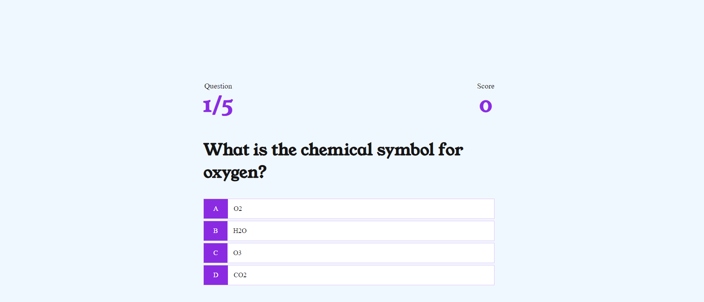

# Quiz Game (JavaScript Game)

QUIZ Game is a responsive website built for the sole purpose of completing the Milestone Project#2 for the Code Institute's Full Stack Developer course. It was built using the knowledge gained from the HTML, CSS and JavaScript modules.

The live website can be viewed here [QUIZ GAME](https://bogdanmaria.github.io/Quiz-Game/).

.

# UX Design

## User stories

### As a **first time user**

- I want to understand easily the purpose of the website and how to use it.
- I want to be able to play the game easily.
- I want to be able to navigate easily.
- I want to be amused.

### As a **returning** and a **frequent user**

- I want to have different questions without repetitions.
- I want to play multiple games.
- I want to compare my results with other players to see how I am performing.

### All users want to be able to access and comfortably view the website on mobile devices

## Design

### Typography

[Young Serif](https://fonts.google.com/specimen/Young+Serif?query=young) was chosen due to it being neutral, soft and easy to read even on smaller screens.

### Colour Scheme

#### 16151C
Has been used to display the Questions and answers.

#### F0F8FF
Has been used for background.

#### D2BAED
Has been used to create the box shadows.

#### 8A2BE2
Has been used for the headings.

### Wireframes

#### Home

#### Questions and answers

#### Your Score and name

#### High Scores

## Features

### Main Page

On main page you can select to play the game or see the high scores.

### Play Page

On the play page you have the progress of the game, score, questions and multiple choice answers.

### Score and username 

At the end of the game you can see your score, enter your username for the high score board and save, play again or go to the home page

### High scores

On the high scores page you will see the top five scores and usernames.

All the buttons have a shadow when you hover over them and change the cursor. When a correct answer is selected the answer turns green and the score will go up. When a incorrect answer is selected the answer turns red. The progress will show what question you are on out of 5. At the end you can not press save unless there is a username typed.

# Technologies

- HTML to accomplish the structure of the website.
- CSS to style the website.
- [Codeanywhere](https://app.codeanywhere.com/) IDE to develop the website.
- [GitHub](https://GitHub.com/) to host the source code and GitHub Pages to deploy and host the live site.
- Git to provide version control (to commit and push code to the repository).
- [Google Fonts](https://fonts.google.com/) for typography.
- [Google Chrome Dev Tools](https://developers.google.com/web/tools/chrome-devtools) for debugging, inspecting pages' elements and testing layout.
- [Favicon.cc](https://www.favicon.cc/) to create the website favicon.
- [Color](https://coolors.co/image-picker) to source colour palette.
- [Balsamiq](https://balsamiq.com/wireframes/) to design wireframes.
- [Amiresponsive](https://ui.dev/amiresponsive) to create the Mockup image in this README.
- Google Chrome's [Lighthouse](https://developers.google.com/web/tools/lighthouse) to assess accessibility.
- [W3C HTML Markup Validator](https://validator.w3.org/) to validate HTML code.
- [W3C Jigsaw CSS Validator](https://jigsaw.w3.org/css-validator/) to validate CSS code.
- [Chat GPT](https://chat.openai.com/auth/login) to generate the questions for the quiz.
- Code Institute's Gitpod Template to generate the workspace for the project.

# Deployment

This project was deployed to GitHub pages. The steps to deploy are as follows:

1. Log into GitHub.
2. Select `Quiz-Game` from the list of repositories.
3. Select `Settings` From the Repositories sub-headings.
4. In the left side menu select `Pages` from `Code and automation` section.
5. Under the `Source` heading in the dropdown menu select `main`.
6. A second drop-down menu should remain with the default value `/(root)`.
7. Press `Save`.
8. A message that the website is ready to be deployed will appear, refresh the page and the link to the deployed site will be available in a green sub-section on the top of the page.
9. Click on the link to go to the live deployed page.

The live link can be found [here](https://bogdanmaria.github.io/Quiz-Game/index.html).

## How to run this project Locally

- **Clone the repository**

1. Navigate to the GitHub Repository `BogdanMaria/Quiz-Game`.
2. Click the `Code` drop-down menu.
3. Click the `HTTPS` sub-heading under the `Clone` heading.
4. Copy the link.
5. Open an IDE of your choice (VSCode, Atom, Komodo, etc).
6. Open a terminal in the directory of your choice, type `git clone` and paste the link.
7. A clone of the repository will now be created on your machine.

# Testing

## Manual Testing

Design was tested manually in three browsers:

- Chrome,
- Firefox,
- Safari,

on multiple devices:

- mobile devices
  - iPhone 14,
  - Samsung Galaxy S22 Ulta,
  - Samsung Galaxy S21 Plus,
- tablets
  - Samsung Tab 9
  - Ipad Air mini
- laptops
  - Hp Omen,
  - Dell Inspirion

Certain minor differences were detected, but no issues affected the overall performance.

## Automated Testing

1. [W3 Markup Validation](https://validator.w3.org/) - HTML Validation

All pages were run through HTML Validator. No errors were detected.

2. [W3 Jigsaw](https://jigsaw.w3.org/css-validator/) - CSS Validation

CSS Stylesheet was run through CSS Validator. No errors were detected.

3. [Google Lighthouse](https://developers.google.com/web/tools/lighthouse)

#### Home Page

Mobile

Desktop

#### Play

Mobile

Desktop

#### Username

Mobile

Desktop

#### High Scores

Mobile

Desktop

# Credits

## Content 
The questions used in the quiz game have been generated using [Chat GPT](https://chat.openai.com/auth/login).

## Media
The favicon.ico has been vreated by me.

## Code

JSON had been studied using [W3Schools](https://www.w3schools.com/js/js_json_intro.asp)

# Acknowledgements

I would like to thank my mentor, Ronan McClelland, for his guidance,  moral support, inspiration and invaluable advice.

Thanks to Slack Community for answering all my questions before I asked  them.
